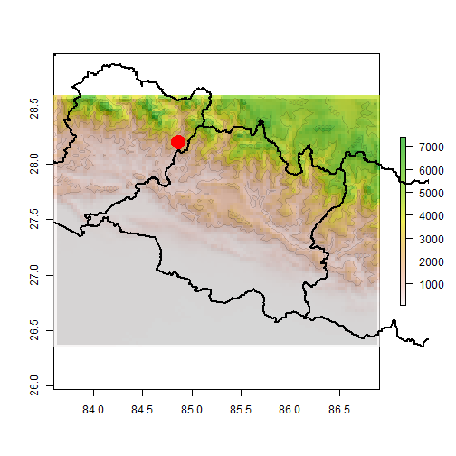
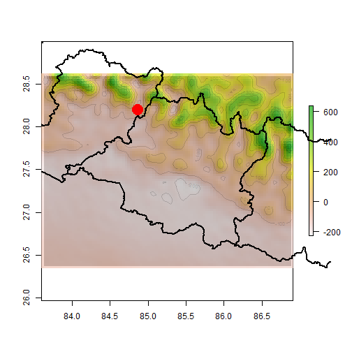

Using Earth's gravity to understand the April 2015 Nepalese earthquake
========================================================
author: Joshua Poirier
date: Sun Apr 26 16:21:35 2015
transition: rotate


Topography and Gravity Science
========================================================

Earth's topography and gravitational field fluctuates spatially depending on where you are on the Earth.  Understanding this spatial variation assists scientists aiming to:

- Study Planetary Science
    + Plate tectonics
- Explore for natural resources
    + Minerals, Hydrocarbons, etc.
- Assess the risk for natural disasters
    + Floods
    + Earthquakes

Code
========================================================
Code to download and plot the Free Air Anomaly gravity data for the Central state in Nepal.
<small><small><small>

```r
# get boundary of Nepal - Central state
shp <- getData('GADM', country='NPL', level=1)
j <- which(shp$NAME_1 == "Central")
b <- findExtents(shp@polygons[[j]])

# retrieve topo and grav data
g <- getSSData(b, 0.1)

# data processing
r <- raster(nrows=length(table(t$Lat))/2, ncols=length(table(t$Lon))/2,
                            xmn=min(t$Lon), xmx=max(t$Lon),
                            ymn=min(t$Lat), ymx=max(t$Lat))
faa <- rasterize(t[,1:2], r, g$FAA)
slope <- terrain(faa, opt='slope')
aspect <- terrain(faa, opt='aspect')
hill <- hillShade(slope, aspect, 45, 45)

# plot data
plot(hill, legend=FALSE, col=grey(0:100/100))
plot(faa, add=TRUE, alpha=0.65)
contour(faa, add=TRUE, col=rgb(0,0,0,alpha=0.15))
plot(shp, add=TRUE, lwd=2.5)
points(84.865, 28.193, pch=19, col="red", cex=3)
```
</small></small></small>

Case Study - Central state, Nepal
========================================================

Topography
<small><small><small>Red dot = April 25, 2015 M6.6 Earthquake epicenter</small></small></small>
 

***

Gravity
<small><small><small>Red dot = April 25, 2015 M6.6 Earthquake epicenter</small></small></small>
 

Case Study - Conclusions
========================================================

- Both data sets have a clear NW-SE trend
- This trend represents the tectonic boundary between the Indian and Eurasian plates
- The (relatively) rapid subduction of the Indian plate built the Himalayan mountains
- The subduction zone also caused the devastating M6.6 earthquake in Nepal's Central state
- Gaining a better understanding the locations of this and other subduction zones could identify areas at risk for devastating earthquakes
- Please visit the [web app](http://joshuaadampoirier.shinyapps.io/Project) to examine topography and gravity data in other regions of the Earth
